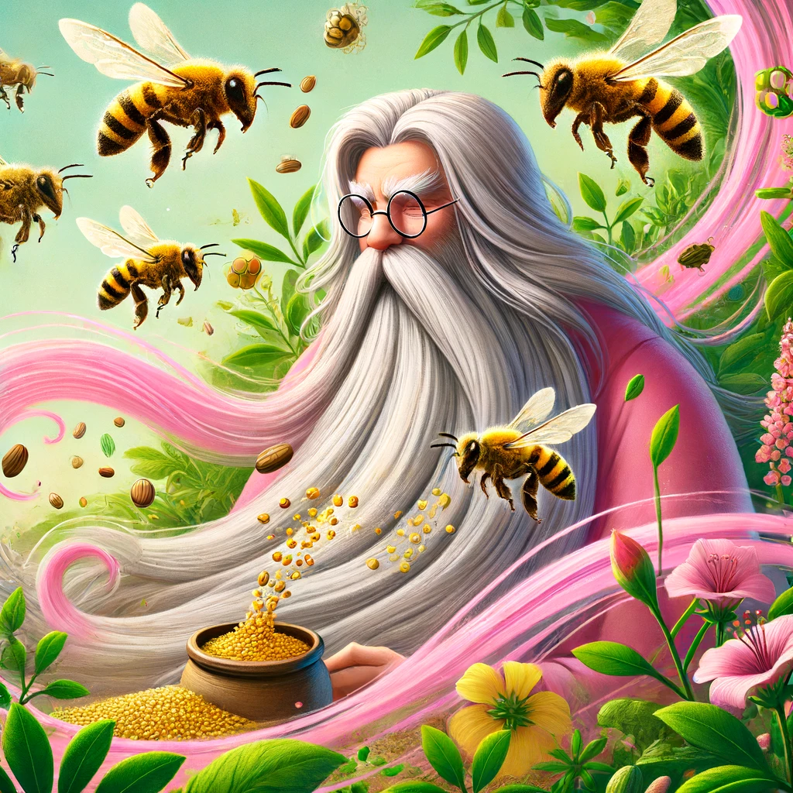

# Bee-Seed Alliance

> **Bees and seeds are inextricably entwined**: without seeds to grow plants, there would be little nectar or pollen. Without bees to pollinate plants, there would be few seeds, if any.

Welcome to the Bee-Seed Alliance! This repository is dedicated to fostering biodiversity by exploring the interconnected relationships between bees, seeds, and pollinator-friendly ecosystems. Here you'll find:

- A **gallery of pollinators, seeds, and forage plants**.
- Tools and resources for creating **pollinator-friendly gardens**.
- Educational content to promote **seed saving** and **biodiversity**.

---

## Features
- **Pollinator Image Gallery**: Stunning images of bees and other pollinators.
- **Seed and Plant Information**: Data on forage plants, bloom times, and seed-saving techniques.
- **Educational Materials**: Guides on biodiversity and pollinator gardens.

---

## Table of Contents
- [About](#about)
- [Gallery](#gallery)
- [Resources](#resources)
- [Contributing](#contributing)

---

## Gallery

---

## Contributing
We welcome contributions to the Bee-Seed Alliance! Please submit an issue or a pull request to share images, data, or resources.

---

## License
This project is licensed under the [Creative Commons Attribution-NonCommercial-ShareAlike 4.0 International License](https://creativecommons.org/licenses/by-nc-sa/4.0/).

